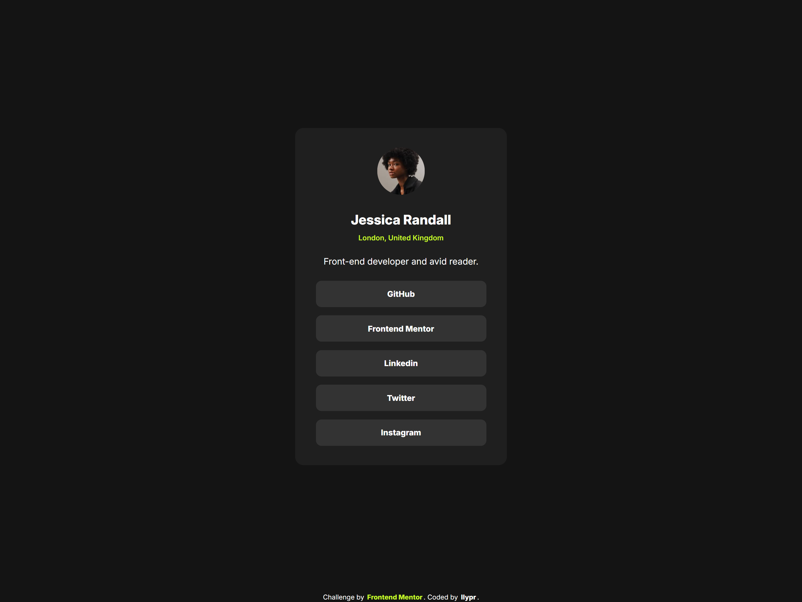

# Social links profile

## Table of contents

- [Overview](#overview)
  - [The challenge](#the-challenge)
  - [Screenshot](#screenshot)
  - [Links](#links)
- [My process](#my-process)
  - [Built with](#built-with)
  - [What I learned](#what-i-learned)
- [Author](#author)

## Overview

### The challenge

Users should be able to:

- See hover and focus states for all interactive elements on the page
- Ensure that visitors can navigate the links only using their keyboard

### Screenshot

<div style="text-align:center;">
  
  
</div>

### Links

- [github-code](https://github.com/ilypr/Social-links-profilem)
- [Live server](https://ilypr.github.io/Social-links-profile/)

## My process

### Built with

- Semantic HTML5 markup
- CSS custom properties
- Flexbox
- Mobile-first workflow

### What I learned

Throughout this project I learned how to use :root pseudo-class to optimize the process of changing colors of a certain elements as well as the use of the @media tag to change the theme of a webpage based on the user's device's main theme colorway.

```html
<h1>:root usage for the colors</h1>
```
```css
/* ======== colors for the webpage ======== */
:root {
  --green: hsl(75, 94%, 57%);
  --white: hsl(0, 0%, 100%);
  --black: hsl(0, 0%, 0%);
  --grey-700: hsl(0, 0%, 20%);
  --grey-800: hsl(0, 0%, 12%);
  --grey-900: hsl(0, 0%, 8%);
}

/* ======= Webpage theme switch based on the device theme ======= */
@media (prefers-color-scheme: light) {
:root {
  --green: hsl(244, 75%, 63%);
  --white: hsl(0, 0%, 0%);
  --black: hsl(0, 0%, 100%);
  --grey-700: hsl(0, 0%, 95%);
  --grey-800: hsl(0, 0%, 88%);
  --grey-900: hsl(0, 0%, 96%);
}
}
```

Also, in this project I've deepened my knowledge of the :focus-visible property, as well as how to use :root colors to change the looks of links and button hover effects using the var value.

```css
a:hover {
    background-color: var(--green);
    color: var(--black);         
}

/* ========== Footer ========== */
.license {
    font-size: 12px;
    text-align: center;
    color: var(--white);
}

.license a {
    text-decoration: none;
    color: var(--green);
    transition: 0.4s;
    border-radius: 2px;
    padding: 2px;
}

a:link {
    color: var(--white);
    text-decoration: none;
    font-weight: 800;
}

a:hover {
    background-color: var(--green);
    color: var(--black)
}
```

## Author

- Frontend Mentor - [@ilypr](https://www.frontendmentor.io/profile/ilypr)
